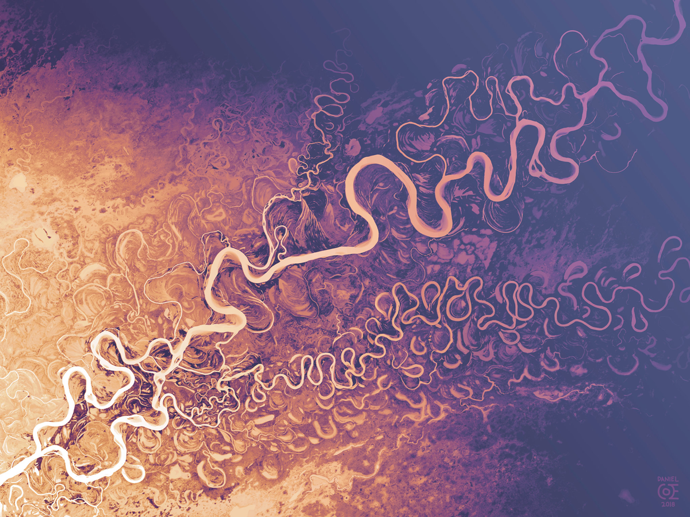

# pkgdown [{align="right" alt="" width="100"}](https://dancoecarto.com/)

<!-- badges: start -->

<!-- badges: end -->

**{easyREM}** is an R package designed to simplify the creation of
Relative Elevation Models (REMs). By utilizing Digital Elevation Models
(DEMs) and a specified region of interest, the package streamlines the
process of generating and visualizing REMs.

## How It Works

The package is a collection of functions that simplify the retrieval and
creation of Relative Elevation Models (REMs). REMs are a method for
visualizing and analyzing elevation differences within a specific area.
A more detailed explanation of REMs is provided in the vignette section
of the package.

The package offers the following functionalities through its functions:

-   **Digital Elevation Model (DEM):** The package retrieves DEM data
    from the USGS service, offering a resolution of 1 meter for North
    America and 30 meters for the rest of the world.

-   **River Lines:** Shapefiles for river lines are obtained from two
    primary sources:

    -   OpenStreetMap (OSM) Data

    -   The HydroSHEDS Project.

The interpolation method used in the package is the well-known
Inverse-Distance Weighting (IDW) technique, which is based on research
from the Washington State Department of Ecology.

The development of this project is a small contribution to the vast
open-source software community. Facilitating scientific processes by
sharing knowledge is a core principle of our society.

## Article

For a more detailed introduction to REMs, the methodology behind them,
and further reading, please refer to this [Article]. It also serves as a
guide to exploring the power of R Notebooks and the open-source R
community.

## Installation

You can install the development version of **{easyREM}** from GitHub
using the `remotes` package. Note that the package is not currently
available on CRAN. To install it, use the following code:

``` r
library(remotes)
remotes::install_github("emanuel-gf/easyREM")
```

After installation, you just need to call the package. :)

## Disclaimer

The package was developt as part of Application Development Course,
under the Z-GIS department of the Paris-Lodron University of Salzburg.
The package is under development and further features should take place
at any moment.
