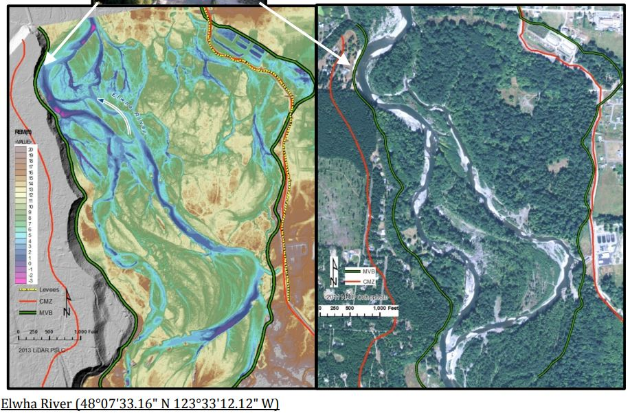

# Relative Elevation Models

Relative Digital Models (REM) are a way to visualized and exposed differences of elevation for a particular region of interest (ROI) and highlight patterns that regarding land surface.

The REM are used as a methodology to delineating Planning-Level Channel Migration Zones, propoused by Washignton State Department of Ecology and regulate development within these areas on shoreline streams.
[CMZ - Washington Ecology Dept.](https://apps.ecology.wa.gov/publications/documents/1406025.pdf)

[](https://apps.ecology.wa.gov/publications/documents/1406025.pdf)

This notebook aims to help everyone interest in hydrology, water and urban management.

## Libraries and dependencies

First we install the easyREM library hosted in github.

```{r}
library(remotes)
remotes::install_github("emanuel-gf/easyREM")
library(easyREM)
```

## Creating Boundaries (bbox)

To delimitate the boundaries of the region of interest (ROI) I used the ArcGIS web map to look at the USGS tiles and its covering regions stored on the web-service.

The points represents the left-down and right-up corners of the ROI.

```{r}
##Set boundaries of the bbox
xmin <- -93.382
ymin <- 34.2653
xmax <- -93.361
ymax <- 34.275

## Set CRS
crs <- 4326  ##WGS84

### Creating the BBox
bbox <- create_bbox(xmin, xmax, ymin, ymax,crs=crs)

## Visualizing the bbox
mapview::mapview(bbox,alpha=0.1,map.types ='Esri.WorldImagery')

```

## Digital Elevation Rasters

### USGS DEM

The USGS web-service provides an easy way to download its data from

Download the files from the USGS service.

Depending the size of the ROI, it may take it a while.

```{r}
library(progressr)
handlers("progress")
with_progress(
dem <- terrainr::get_tiles(
    data = bbox,
    output_prefix = "rem",
    side_length = NULL,
    resolution = 2, #meters
    services = "elevation",
    verbose = TRUE
    )
)

sprintf('The DEM tiles are compose by %s tile(s)',length(dem$elevation))
```

From USGS service, each tile has an size of 7948X7948, with a spatial resolution of 1meter, returns a tile of nearly 8 km.

Sometimes, the ROI is covered by more than one tile, and it is necessary to composite a mosaic of the tiles to deal it properly.
To properly mosaic, some attributes needs to be consider such as matching the Spatial Resolution and CRS.
The function deals with mosaicing objects, the only variable to pass is a list that is provided from the terrainR get_tiles function.
In case you already have download the tiles, you can easily recreate the list by running the following code

```{r}
### In case you have already downloaded the tiles
dem <- c()
dem$elevation <- list.files(
  "D:\\Desktop\\COPERNICUS\\Classes\\Project-python-arcgis-R\\R-part\\R-Tool-DEM\\.Rproj.user\\shared\\notebooks",
  pattern = "\\.tif",
  recursive=FALSE
)


```

```{r}
##Converting to terra objects
## In case the bbox have only one tile.
if (length(dem$elevation)==1) {
  dem_rast <- terra::rast(dem$elevation)
  dem_rast <- terra::rast("rem_3DEPElevation_1_1.tif")
} else {
  ## For more than one tile is necessary to create a composition
  dem_rast <- process_dem_tiles(dem,verbose=TRUE)
}
```

```{r}
### Merge the raster
dem_mosaic <- terra::merge(dem_rast[[1]],dem_rast[[2]],dem_rast[[3]],
                           dem_rast[[4]],
                           #dem_rast[[5]],dem_rast[[6]],
                           filename='merged.tif',
                           overwrite=TRUE)

```

##River Line

In order to create REM objects, it is an important step to mapped the centerline of river channels.
Rivers data can be retrieved in many ways, the following process exemplifies how do it by\
\### OSM DATA - RIVERS

```{r}
# Retrieve OSM Data
river <- osmdata::opq(
    bbox = sf::st_bbox(bbox)
) |>
    osmdata::add_osm_feature(
        key = "waterway",
        value = "river"
    ) |>
  osmdata::osmdata_sf() ##Simple feature objects 

river_sf <- river$osm_lines |> ## Intersect the bbox
    sf::st_intersection(
        bbox
    ) |>
    sf::st_union() |>
    sf::st_cast(
        "LINESTRING"
    ) |>
  sf::st_as_sf()

```

Plot to visualize the river shapefiles retrieved from OSM

```{r}
##Visualize the river 
terra::plot(dem_rast)  
plot(
    sf::st_geometry(
        river_sf
    ),
    col = "white",
    add = TRUE
)
```

### HydroSheeds Project

Another way to retrieve rivers shapefile is through the project HydroSheeds <https://www.hydrosheds.org/>.
To facilitate the process, the package contain a function that download it on your current folder as a .shp file.
The function requires a region that is sourced from the HydroSheeds region mapping, where Global and regions Africa, South America, Asia, Australia/Oceania, Europe, North America.
More information can be reached here: LINK TO THE EXPLATION PAGE IN GITHUB LINK TO THE HYDROSHEEDS PROJECT

In order to figure out where our region of interest is located regarding the atlas provided by HydroSheeds project, a function is called to check it

```{r}
determine_hydrosheds_region(sf::st_bbox(bbox)["xmin"],sf::st_bbox(bbox)["ymin"])
```

So, the correct HydroSheed Rivers dataset is downloaded

The glossay of HydroRivers are: - sa = South America - ar = Artic - as = Asia - eu = Europe and Middle East - au = Australasia -

```{r}
rivers_ar <- download_hydrorivers("na")

print(rivers_ar)
```

Filter only where the boundary box intersects the Rivers geofiles.

```{r}
rivers_intersect <- get_intersecting_rivers(rivers_ar,bbox)
```

Plot the WaterSheeds Rivers to compare with others Datasets.

```{r}
terra::plot(dem_rast)  
plot(
    sf::st_geometry(
        rivers_intersect
    ),
    col = "white",
    add = TRUE
)
```

Due the fact the HydroSheeds project been generate by the USGS DEM-30meters, the rivers are delineate by the accumulation flow and for the flats areas the accumulation flow algoritm does not exactly matches the center of a river line.
To deal with the situation in the most accuracy as possible, it is possible to create the river centerline with several ways and approaches propoused by Remote Sensing imagery.

For the sense of propouse on this tutorial, we are gonna to attach at the OSM data due the fact that it matches enough.

## Extract Elevation Values

Extracting elevation values is a strategy of populating the river shapefile with elevation from the DEM raster.
It is an crucial step to develop the REM model.

Depending on your computational capacity, resampling the raster is needed it.
Also, with a resolution of 1 meter, for river changed capted trhough each point was finer, less than 1 meter, and for the whole area analysis is too computational expensive.

```{r}
## Resampling the raster to 5 meters. 
#dem_rast_agg <- terra::aggregate(
#    dem_rast,
#    fact = 2
#)

river_elev <- terra::extract(
    x = dem_rast,
    y = terra::vect(river_sf),
    xy = TRUE,
    na.rm = TRUE
) |>
    na.omit()

names(river_elev)[2] <- "elevation" #Rename the column to elevation
print(c(nrow(river_elev),'elevation points were extracted'))
```

## Interpolation

### IDW - Inverse Distance Weighting

Inverse distance weighting is a spatial technique and well-spreaded over the geospatial field.
IDW takes into consideration that close points are more weighted than relative far points.
points that are further away get less weight in predicting a value a location The IDW for delineation of Bottom Valley Channel (BVC) was used by the Washington Department of Ecology and its studies can be found it here: <https://apps.ecology.wa.gov/publications/documents/1406025.pdf>

In order to apply the method on R, the package gstat is called an creates the IDW interpolation by the gstat object.

```{r my-stat-model, cache = TRUE}
## Create IDW model
idw_model <- gstat::gstat(
  formula = elevation ~ 1,
  locations = ~x + y,
  data = river_elev,
  nmax = nrow(river_elev)
)

## Predict Values by Interpolating 
river_surface <- terra::interpolate(
  dem_rast,
  idw_model,
  crs=terra::crs(dem_rast)
)
```

## Relative Elevation Model

The relative elevation model is nothing more than the subtraction of the river interpolation raster by the digital elevation model.

```{r}
terra::plot(river_surface)

```

```{r REM}
rem <- dem_rast - river_surface

rem_final <- terra::resample(
    rem, dem_rast
)

```

PLOT

```{r}
terra::plot(rem_final)
```

## Visualize

```{r}
rem_df <- as.data.frame(
    rem_final,
    xy = TRUE
)

head(rem_df)

names(rem_df)[3] <- "elevation"
```

Computes logarithms from elevation

```{r my-breaks-plot-stats, cache = TRUE}

epsilon <- 1e-10

rem_df$elevation_log <- log1p(
    pmax(
        rem_df$elevation, epsilon
    )
)

breaks <- classInt::classIntervals(
    rem_df$elevation_log,
    n = 12,
    style = "fisher",
    largeN=TRUE,
    samp_prop = 0.1
)$brks
```

```{r}
### Let`s make a quick plot to visualize the REM

#Create a pallette 
cols <- hcl.colors(
    palette = "vik",
    12, rev = TRUE
)
#Vis
pie(rep(
    1, length(cols)
), col = cols)

# SELECT THE PALLETTE
pal <- cols[c(1, 2:12)]
```

```{r}
theme_for_the_win <- function() {
    theme_minimal() +
        theme(
            axis.line = element_blank(),
            axis.title.x = element_blank(),
            axis.title.y = element_blank(),
            axis.text.x = element_blank(),
            axis.text.y = element_blank(),
            panel.grid.major = element_blank(),
            panel.grid.minor = element_blank(),
            legend.position = "none",
            plot.background = element_rect(
                fill = "white", color = NA
            ),
            plot.margin = unit(
                c(
                    t = 0, r = 0,
                    l = 0, b = 0
                ), "cm"
            )
        )
}

theme_for_vis <- function() {
    theme_minimal() +
        theme(
            axis.line = element_blank(),
            axis.title.x = element_blank(),
            axis.title.y = element_blank(),
            axis.text.x = element_blank(),
            axis.text.y = element_blank(),
            panel.grid.major = element_blank(),
            panel.grid.minor = element_blank(),
            legend.position = "right",  
            legend.title = element_blank(),
            legend.key.height = unit(1.5, "cm"),
            legend.key.width = unit(0.5, "cm"),
            plot.background = element_rect(
                fill = "white", color = NA
            ),
            plot.margin = unit(
                c(
                    t = 0, r = 0.5, 
                    l = 0, b = 0
                ), "cm"
            )
        )
}
```

```{r my-slow-computation-plot, cache = TRUE}
rem_plot <- ggplot(
                    rem_df, aes(
                    x = x, y = y,
                    fill = elevation_log
                    )
                  )+
                     geom_raster() +
                     scale_fill_gradientn(
                         breaks = breaks,
                         colours = pal,
                         name = ""
                     ) +
                     theme_for_the_win()
rem_plot
```

```{r my-slow-computation-plot2, cache = TRUE}
rem_plot <- ggplot(
    rem_df, aes(
        x = x, y = y,
        fill = elevation_log
    )
) +
    geom_raster() +
    scale_fill_gradientn(
        breaks = breaks,
        colours = pal,
        name = "Elevation (log)",
        labels = sprintf("%.2f", breaks)
    ) +
    theme_for_vis()

rem_plot
```

```{r my-slow-computation-3, cache = TRUE}
rem_plot <- ggplot(
    rem_df, aes(
        x = x, y = y,
        fill = elevation_log
    )
) +
    geom_raster() +
    scale_fill_gradientn(
        breaks = breaks,
        colours = pal,
        name = "Elevation (m)",
        # Transform back using expm1() which is the inverse of log1p()
        labels = sprintf("%.2f", expm1(breaks))  # Using %.0f to round to whole numbers
    ) +
    theme_for_vis()

rem_plot
```

Easily creating a contour line for the REM model

```{r my-slow-computation-4, cache = TRUE}
## Contour Line
contour_line <- terra::contour(rem_final)

## Plot the contour line 
```
